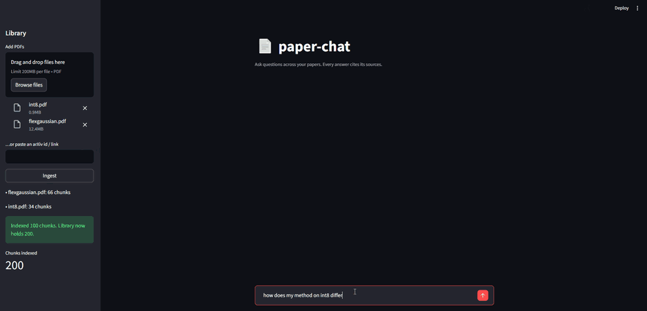

# paper-chat

**Ask questions across a library of papers — and get answers that cite their sources.**

[](https://github.com/Daceyyreal/paper-chat/releases/latest)
[](https://github.com/Daceyyreal/paper-chat/actions)


<p align="center"></p>

Drop in a folder of PDFs (your own papers, the related work you're reading,
anything from arXiv), ask a question, and get a grounded answer where **every
claim points back to the source paper and page**. Built to actually use on a
real literature pile — including cross-paper questions like *"how does my method
differ from FlexGaussian?"*

Runs on a free tier: **Groq or Gemini** for generation (set `PC_LLM_PROVIDER`), local
[sentence-transformers](https://www.sbert.net/) embeddings (no embedding API bill), and a
numpy vector store (no database to stand up).

## Why it's not just another RAG demo

- **Real citations.** PDFs are parsed per page, so retrieved chunks carry a
  `(paper, page)` tag. The model is forced to cite `[S#]` tags, and the UI shows
  exactly which sources each answer used — and which it didn't.
- **Cross-paper.** One index over many papers, so you can compare and contrast,
  not just query a single document.
- **arXiv in one paste.** Drop an id or `arxiv.org/abs/...` link and it fetches
  and indexes the PDF.
- **Honest when it doesn't know.** Grounded-only prompting; if the sources don't
  cover it, it says so instead of hallucinating.

## Quickstart

```bash
git clone https://github.com/Daceyyreal/paper-chat
cd paper-chat
pip install -e ".[full]"          # heavy deps: torch, streamlit, pymupdf, groq
cp .env.example .env              # add GROQ_API_KEY — or set PC_LLM_PROVIDER=gemini + GEMINI_API_KEY
streamlit run app.py
```

Then add PDFs (or an arXiv link) in the sidebar, click **Ingest**, and ask away.

## Architecture

```
ingest.py   PDF/arXiv -> per-page text -> overlapping chunks (carry page #)
store.py    embed chunks -> numpy cosine retrieval   [Embedder is injectable]
chat.py     build a grounded, source-tagged prompt -> LLM -> cited answer
app.py      Streamlit UI
```

The `Embedder` and `LLM` are small protocols, so the retrieval and
citation logic is unit-tested with fakes — no model download or API key needed
to run the test suite (`pip install -e ".[dev]" && pytest`).

## Configuration

Set in `.env` or the environment:

| Variable | Default | |
|----------|---------|--|
| `PC_LLM_PROVIDER` | `groq` | `groq` or `gemini` |
| `GROQ_API_KEY` | — | required for the `groq` provider |
| `PC_GROQ_MODEL` | `llama-3.3-70b-versatile` | any current Groq model |
| `GEMINI_API_KEY` | — | required for the `gemini` provider |
| `PC_GEMINI_MODEL` | `gemini-2.0-flash` | any current Gemini model |
| `PC_EMBED_MODEL` | `all-MiniLM-L6-v2` | any sentence-transformers model |
| `PC_TOP_K` | `5` | chunks retrieved per question |

## Roadmap

- [ ] Persist the index to disk so re-ingesting isn't needed each session.
- [ ] Highlight the exact sentence a citation came from.
- [ ] Section-aware chunking (respect headings, not just character windows).

## License

MIT — see [LICENSE](LICENSE).
